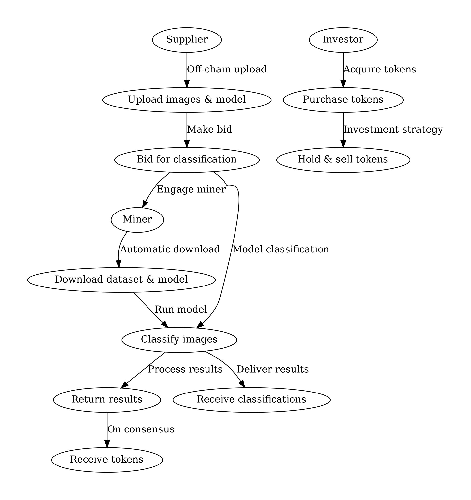
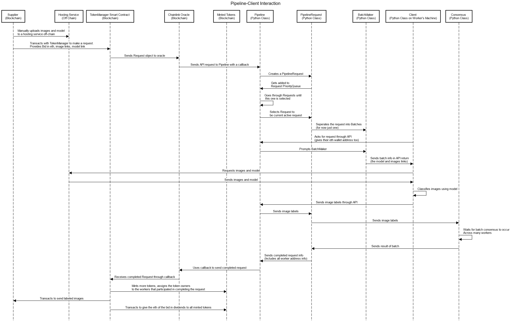

# Proof of Vision Tokens
Imagine a world where researchers, hobbyists, or organizations can have their image data classified without the overhead of setting up sophisticated AI models. At the same time, individuals or entities with computational resources can contribute to solving the vision problems and be compensated for their efforts. Investors can partake in the economy of the platform, buying and selling tokens, adding liquidity and value to the system.

The project aims to develop an integrated system comprising two principal components: a token and smart contract mechanism based on Solidity, and a Python-based pipeline and client interface. The first deliverable entails designing and implementing a smart contract system utilizing Solidity. This system is tasked with managing interactions with image data contributors, primarily bidders and academics, orchestrating the submission of image sources to a processing pipeline, and handling financial transactions which include receiving payments and distributing dividends.

The core functionalities of the smart contract include receiving image and model sources, initiating processing through the pipeline, and handling the output data. Moreover, it ensures the financial transactions are executed securely and efficiently, aligning with the agreed-upon contractual obligations.

The second deliverable focuses on the development of a pipeline paired with a client interface, potentially realized as an API. This component is designed to automate the "mining" of tokens, facilitating user interaction with the system. Key responsibilities encompass receiving image and model sources from the smart contract, deploying the specified computational models on these images, aggregating results to reach a consensus, and relaying the processed information and participation back to the smart contract.

Through this pipeline, users are able to submit image data, which is then processed using predefined models, ensuring the output is reliable and consensus-based before it is returned. This automated mechanism enhances the system's efficiency and user-friendliness, promoting active participation from users in the token mining process.

## Demo/Stakeholders
The system involves three primary end-user groups, each with distinct roles and objectives:

* Worker: These are individuals or entities that provide computational resources to solve computer vision problems. Their main goal is to earn tokens by correctly classifying images using models provided to them. They contribute by downloading datasets and associated models, running classification tasks, and submitting results. The consensus mechanism ensures that only accurate results are rewarded.

* Supplier: These users have image datasets that they wish to classify without doing the computation themselves. Suppliers may be organizations or individuals with large volumes of image data needing classification. They participate by uploading their datasets and related models off-chain and bidding to engage workers to classify their images. Once the images are classified, suppliers receive the results, facilitating their further use in various applications, from research to product development.

* Investor: Investors are interested in the financial aspect of the token associated with the platform. They buy and sell tokens, aiming to profit from their investment. They contribute to the system's economy, providing liquidity and potentially participating in governance, depending on the system's design.

## Workflow

## Class Diagram

## Sequence Diagram

## Project Outcomes
Decentralized Classification System: The primary outcome is a decentralized platform that enables the offloading of image classification tasks to a distributed network of workers, ensuring efficient use of computational resources and democratizing access to machine learning capabilities.

Token Economy: The establishment of a token-based economy that incentivizes participation and ensures fair compensation for computational contributions. This economy would include mechanisms for bidding, payment, and investment, underpinned by a secure and transparent blockchain system.

Quality Assurance: Through consensus mechanisms, the system ensures that only accurate classifications are rewarded, promoting high-quality outcomes and trust in the system.

Accessibility and Scalability: By allowing suppliers to offload computational tasks and investors to participate in the token economy, the system is designed to be accessible to various users and scalable to accommodate a growing number of participants and an increasing volume of data.

Marketplace for Computational Tasks: The development of a second-price market for computational tasks, allowing for more efficient pricing and resource allocation, benefiting both suppliers and workers.

In conclusion, the project is expected to result in a robust, decentralized platform that connects suppliers needing image classification with workers who can provide computational resources, all within an incentivized, economic framework that also offers investment opportunities.
